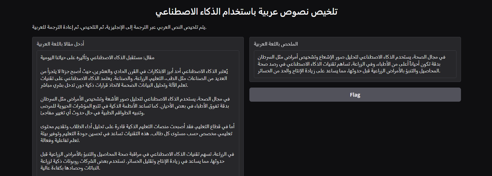

# تلخيص نصوص عربية باستخدام الذكاء الاصطناعي

🎯 **فكرة المشروع**  
يهدف هذا المشروع إلى تطوير نموذج ذكاء اصطناعي قادر على تلخيص النصوص العربية بطريقة ذكية. يتم ذلك من خلال خطوات تشمل:
1. ترجمة النص العربي إلى اللغة الإنجليزية.
2. تنفيذ عملية التلخيص باستخدام نموذج ذكاء اصطناعي.
3. إعادة الترجمة إلى اللغة العربية للحصول على الملخص النهائي.

🧠 **النموذج المستخدم**  
يعتمد المشروع على مكتبات الذكاء الاصطناعي المتوفرة في بيئة Google Colab، باستخدام نماذج جاهزة لمعالجة اللغة الطبيعية (مثل `transformers` من HuggingFace) في الترجمة والتلخيص.

📷 **لقطة شاشة من الواجهة**  

🔗 **رابط Google Colab**  
[فتح المشروع على Google Colab](https://colab.research.google.com/drive/1EIJ-xFb3JcIkMUeGPe2h60GRJxUzgZtY?usp=drive_link)
